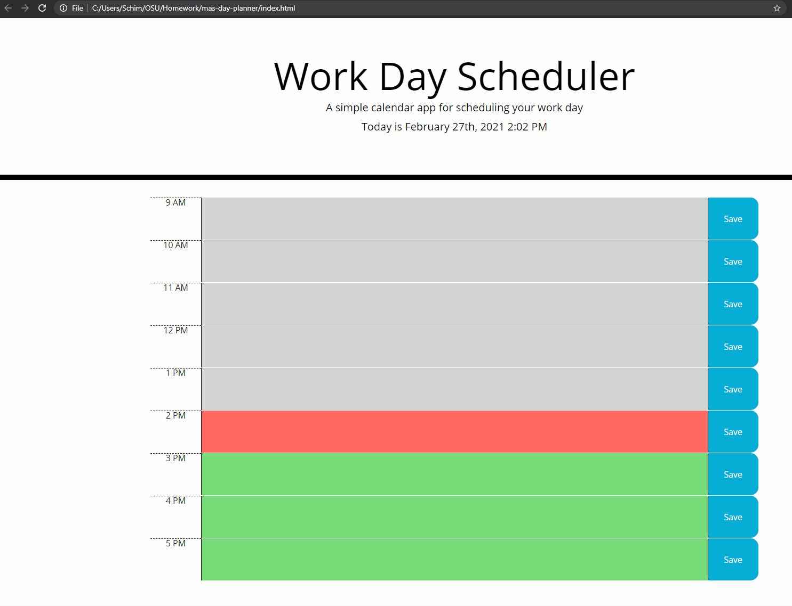

# mas-day-planner

This project is a single day planner that will display the current day and time dynamically. It contains nine time blocks set to the standard 9-5 work day. Each of these has save button off to the right side that will store the input content to the local storage. If a user opens up the application later it will pull the information from local storage that was saved and display it in the input box.
The input boxes will also automatically update based on the time of day to change the background color. The color for past hours will be grey, current hour will be red and future hours will be green.

[MAS Day Planner](https://schimmoellerm.github.io/mas-day-planner/)

## Instructions

1. The user is presented with a planner that displays the current date and time.
2. The user can input text into the input boxes.
3. This information can be saved to the local storage by clicking the save button to the right of the text box.
4. Upon reloading the page the last input taxt will be displayed in the input box.

## Built With
* [VSCode](https://code.visualstudio.com/) - Code editing software
* [GitBash](https://gitforwindows.org/) - Command line interface
* [moment.js](https://momentjs.com/) - Open source JS library that will Parse, validate, manipulate,
and display dates and times in JavaScript.
* [bootstrap](https://getbootstrap.com/) - Front end framework library for HTML and CSS.
* [jQuery] (https://jquery.com/) - JS library that simplifies JS and HTML interactions.

## Authors

* **Mitch Schimmoeller** - *Programmer* - [Schimmoellerm](https://github.com/Schimmoellerm)

## Acknowledgments

* The OSU coding boot camp, its Instructor and TAs who fielded questions regarding this assignment.
* My fellow classmates for providing thoughts and ideas on how to get things working how id like.

